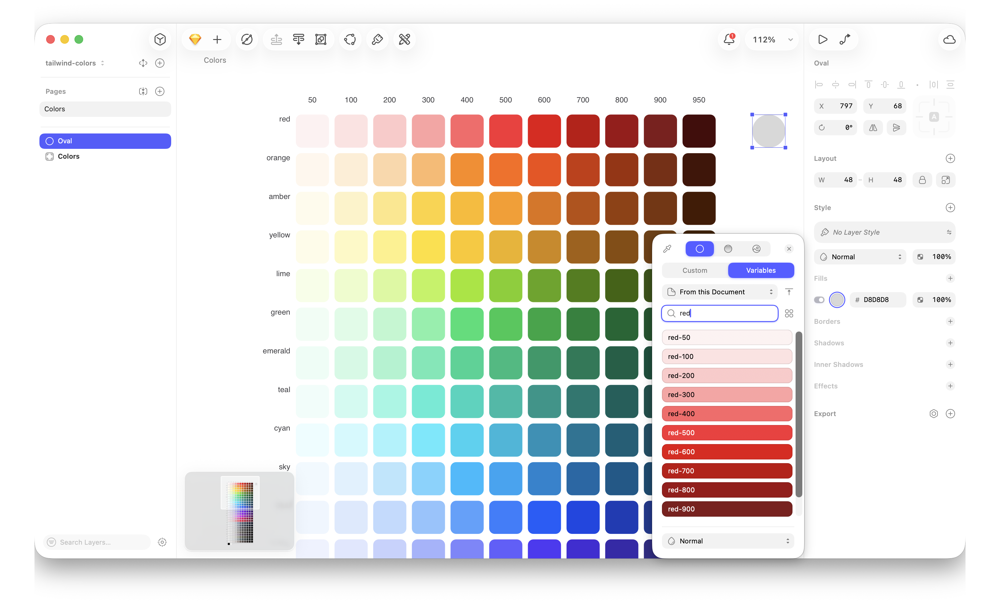
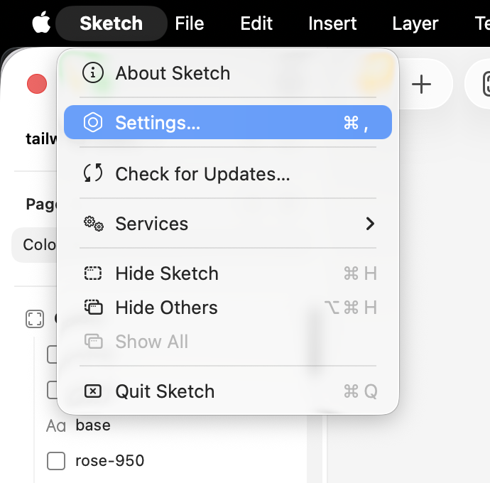
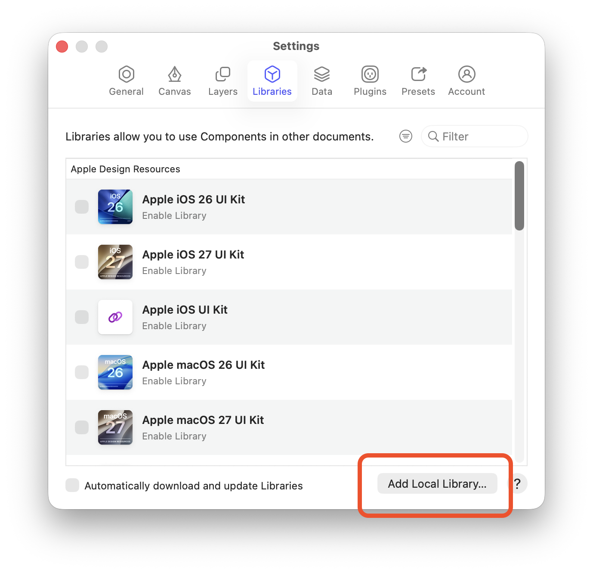
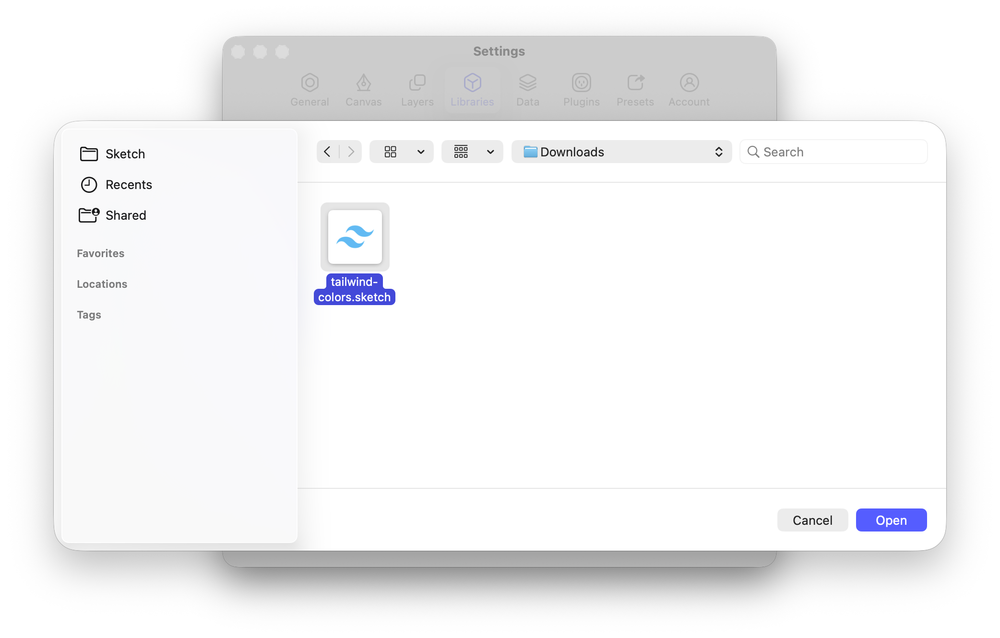

# Tailwind Colors for Sketch

A [Sketch](https://www.sketch.com) library with the full [Tailwind CSS](https://tailwindcss.com/docs/colors) 4.3 palette as native color variables (`blue-500`, `slate-900`, …).

## Installation

[Download `tailwind-colors.sketch`](https://github.com/losnikitos/tailwind-colors-sketch-library/releases/latest/download/tailwind-colors.sketch)

1. In Sketch, open **Settings…** (`⌘,`).

   

2. Go to **Libraries** and click **Add Local Library…**.

   

3. Select `tailwind-colors.sketch` and click **Open**.

   

Pick colors from the **Variables** tab in the color picker.

## Build

```bash
npm install
make
```
