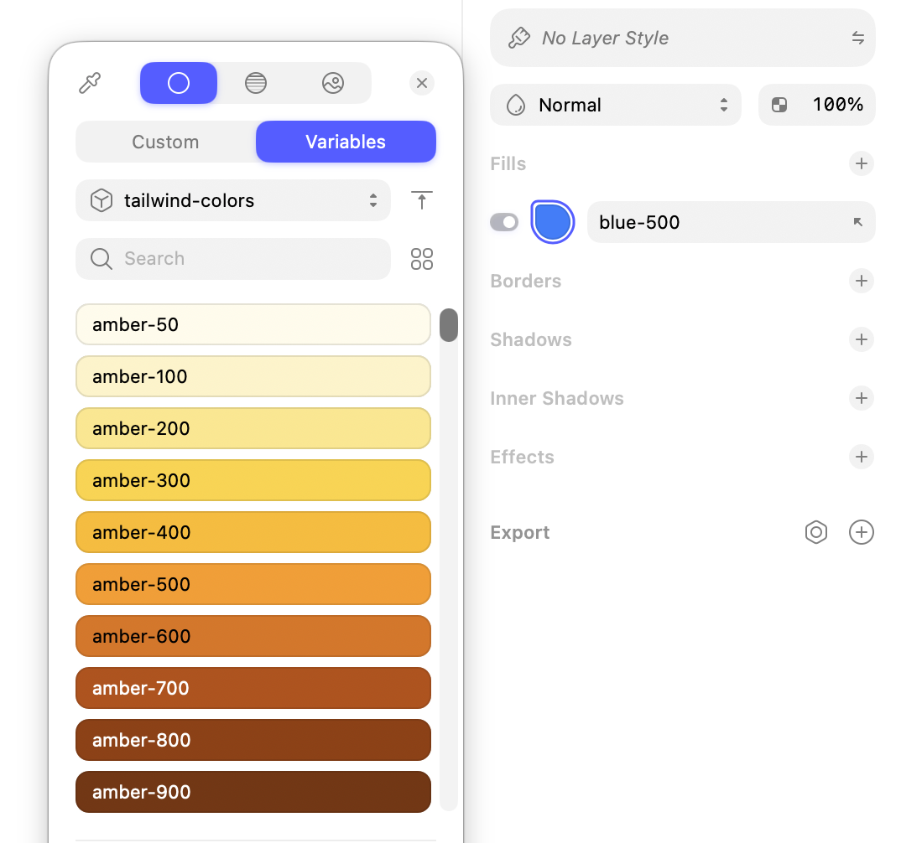
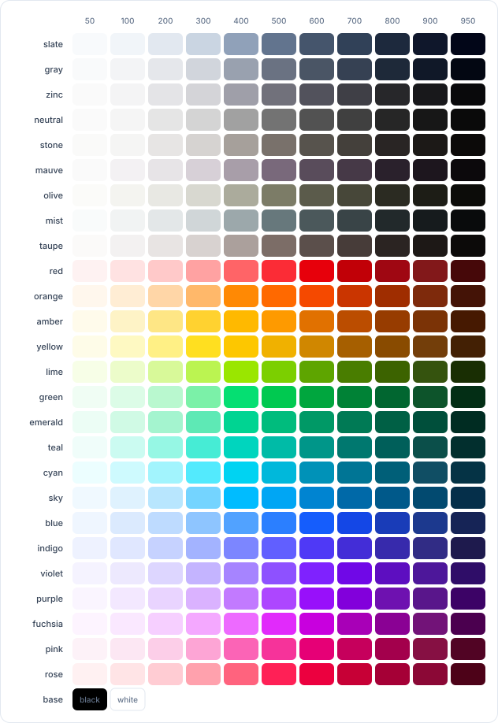

# Tailwind Colors for Sketch

A [Sketch](https://www.sketch.com) library with the full [Tailwind CSS](https://tailwindcss.com/docs/colors) v4 palette as native color variables.

Colors keep Tailwind’s names (`blue-500`, `slate-900`, `amber-50`), so designers and engineers can talk about the same tokens.

## In Sketch

Add the library, then pick colors from the **Variables** tab. Fills, borders, and text can all link to a Tailwind swatch — for example `blue-500`.



## Palette

Every family from the installed Tailwind v4 palette, shades **50–950**, plus **black** and **white**.



Variables are named `family-shade` as a flat list (for example `red-100`). The Sketch file also includes a labeled canvas grid of the same swatches.

## Use the library

1. Build `tailwind-colors.sketch` (see below), or open an already built copy.
2. In Sketch, go to **Settings → Libraries** and add `tailwind-colors.sketch`.
3. Select a layer, open the color picker, and switch to **Variables**.
4. Choose the **tailwind-colors** library and apply a swatch.

Updating the library in Sketch will refresh linked colors in documents that use it.

## Build

```bash
npm install
make
```

That regenerates color variables and the canvas grid from `tailwindcss/colors`, then zips `src/` into `tailwind-colors.sketch`.

```bash
npm run generate   # Sketch JSON only
```

Swatch IDs are stable (UUID v5 from the variable name), so regenerating the library does not break existing references.
