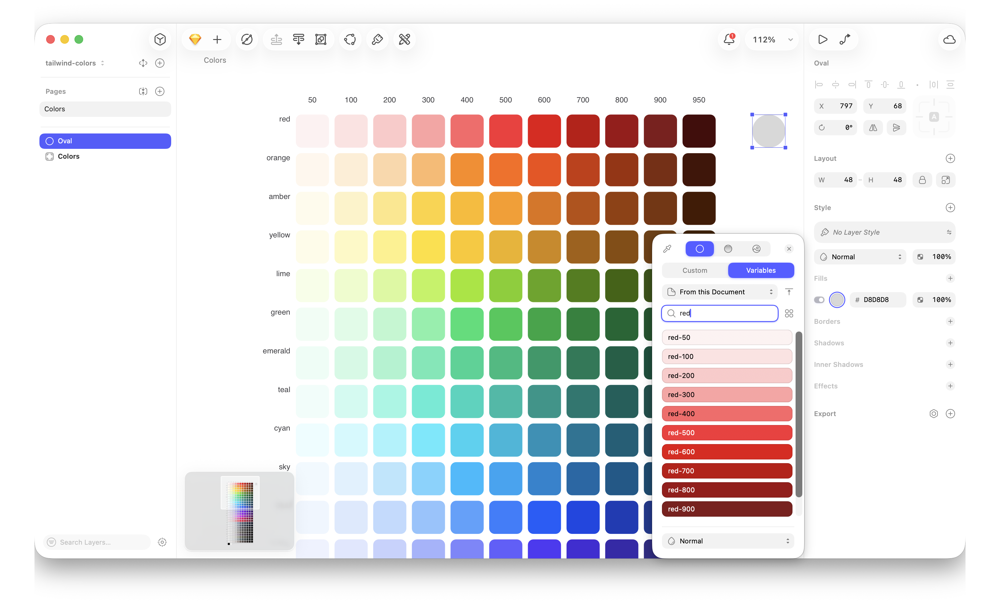

# Tailwind Colors for Sketch

A [Sketch](https://www.sketch.com) library with the full [Tailwind CSS](https://tailwindcss.com/docs/colors) 4.3 palette as native color variables (`blue-500`, `slate-900`, …).

## Installation

### Local library file

<a href="https://github.com/losnikitos/tailwind-colors-sketch-library/releases/latest/download/tailwind-colors.sketch"></a>

1. In Sketch, open **Settings…** (`⌘,`).

   

2. Go to **Libraries** and click **Add Local Library…**.

   

3. Select `tailwind-colors.sketch` and click **Open**.

   

4. Pick colors from the **Variables** tab in the color picker.

   

### Plugin

<a href="https://github.com/losnikitos/tailwind-colors-sketch-library/releases/latest/download/tailwind-colors.sketchplugin.zip"></a>

1. Unzip the download and double-click `tailwind-colors.sketchplugin`.
2. Restart Sketch if it was already open.
3. Pick colors from the **Variables** tab in the color picker.

The plugin copies the library into Application Support and registers it on startup. You can also run **Plugins › Tailwind Colors › Add Tailwind Colors Library**.

Sketch will notify you when an update is available.

## Build

```bash
npm install
make
```

To publish a new plugin version (GitHub release, appcast, Sketch plugin listing):

```bash
npx skpm publish patch
```

## License

MIT. See [LICENSE](LICENSE).
